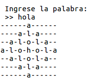
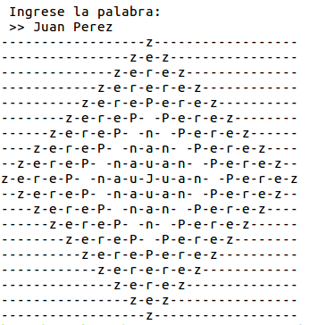

# Palabra rangoli

_**Temas**_: _bucles_, _arreglos_

**Rangoli** es una forma de arte popular de la India basada en la creación de patrones.
Se desea realizar un algoritmo (Desarrollado en Lenguaje C) el cual muestre en pantalla como el siguiente ejemplo.



## Entrada

> El dato de entrada que se debe ingresar es una palabra (arreglo de caracteres) con el cual se desea formar la figura.

## Salida

> Se debe de mostrar por pantalla la figura antes mencionada construida a base de la palabra que se pidió ingresar por teclado.

---

## Ejemplos

### Entrada 0

> Juan Perez

### Salida 0



---

## Solución

```C
#include <stdio.h>
#include <stdlib.h>
#include <string.h>

void vaciar_buffer() {
    int ch;
    while ((ch = getchar()) != '\n' && ch != EOF);
}

void construir_rangoli(char *palabra) {
    int i, j, k;
    int guion = (strlen(palabra)*2)-2;
    int factor, v = 0;

    if (strlen(palabra) == 1)
        printf("\n %s",palabra);
    else {
        for (i=0;i<(strlen(palabra)*2)-1;i++) {
            k = 1;
            for (j=0;j<(((strlen(palabra)*2)-1)*2)-1;j++) {
                if (j != guion) {
                    putchar('-');
                } else {
                    putchar(palabra[strlen(palabra)-k]);
                    if (j < (strlen(palabra)*2)-2) {
                        guion+=2;
                        k++;
                    } else if (j == (strlen(palabra)*2)-2) {
                        factor = guion - 2*k;
                        k--;
                        if (k != 0)
                            guion+=2;
                    } else {
                        k--;
                        if (k != 0)
                            guion+=2;
                    }
                }
            }
            if (factor >= 0 && v == 0)
                guion = factor;
            else if (v == 0) {
                guion = 2;
                v++;
            } else
                guion = factor + 4;
            putchar('\n');
        }
    }
}

int main() {
    char *palabra = (char *)malloc(15 * sizeof(char));

    printf("\n Ingrese la palabra:\n >> ");
    fgets(palabra, 16 * sizeof(char), stdin);
    if (palabra[strlen(palabra)-1] == '\n' )
        palabra[strlen(palabra)-1] = '\0';
    else
        vaciar_buffer();

    construir_rangoli(palabra);
    return 0;
}
```
