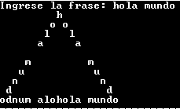

# Triangulo de palabras

_**Temas**_: _strings_, _bucles_, _condicionales_

Realizar un programa que reciba una palabra o frase y que se construya una triangulo con la palabra, pudiendo leerse la palabra por cada lado del triangulo.


## Entrada

> Ingreso de la palabra o frase

## Salida

> Debera observarse la palabra en forma de triangulo

---

## Ejemplos

### Entrada 0

> Programa

### Salida 0

>        P
>       r r
>      o   o
>     g     g
>    r       r
>   a         a
>  m           m
> amargorPrograma

### Explicación

> Se observa que se forma un triangulo isoceles donde en los lados se lee la palabra ingresada y el la base debe salir como un espejo de la palabra desde la última letra hasta la primero y luego de la primera hasta la ultima letra como un espejo.

```C
# include <stdio.h>
# include <stdlib.h>
# include <string.h>

void espacios(int numero){
	int i=0;
	for(i=0;i<numero;i++){
		printf(" ");
	}
}

void triangulo(char frase[100]){
	int j,cantidad=0,distancia;
	cantidad=strlen(frase);
	distancia=cantidad-1;
	for(j=0;j<cantidad-1;j++){
		espacios(distancia);
		printf("%c",frase[j]);
		espacios(1+((j-1)*2));
		if(j!=0){
			printf("%c",frase[j]);
		}
		distancia-=1;
		printf("\n");
	}
	for(j=cantidad-1;j>0;j--){
		printf("%c",frase[j]);
	}
	printf("%s",frase);
}

int main (){
	char frase[100];
	int i,j, cantidad=0;
	printf("Ingrese la frase: ");
	gets(frase);
	cantidad=strlen(frase);
	triangulo(frase);
}

```
